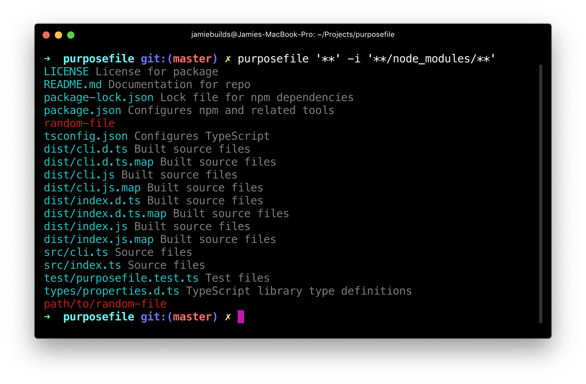
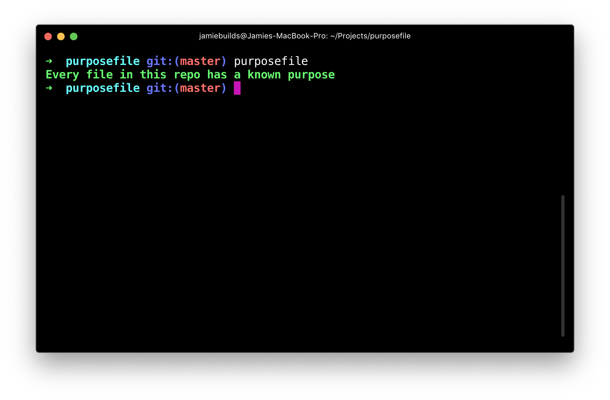
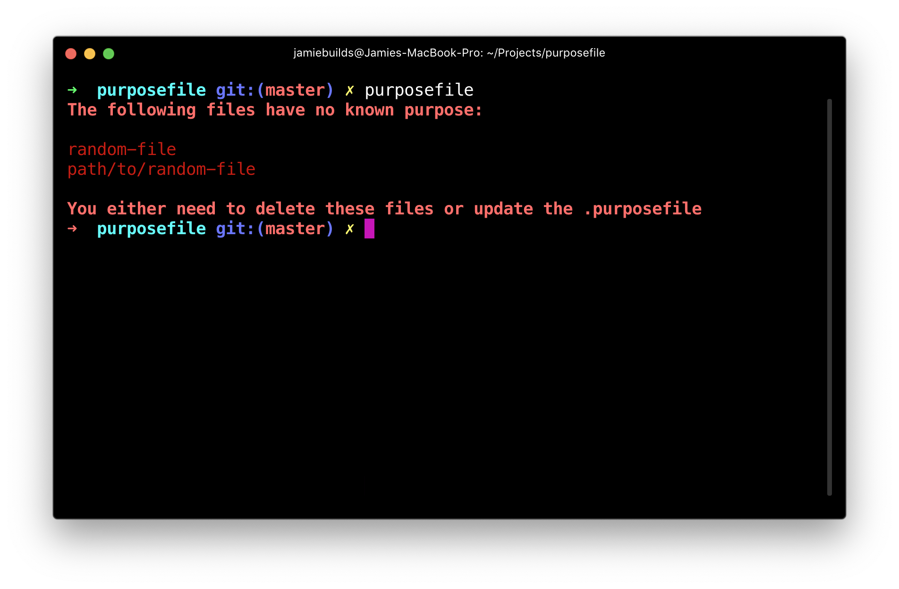
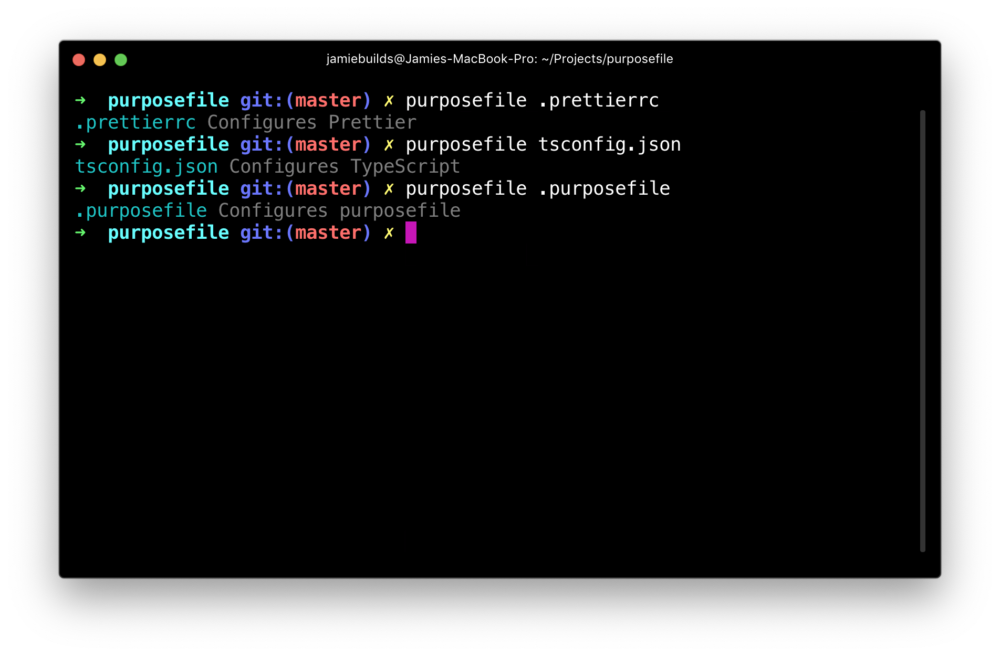

# purposefile

> Make sure every file in your repo is exactly where it should be.



## Install

```sh
npm install --save-dev purposefile
```

## Usage

First create a `.purposefile` in the root of your project like this:

```properties
.purposefile                 Configures purposefile
.gitignore                   Configures git to ignore certain files
.prettierrc                  Configures Prettier
package.json                 Configures npm and related tools
package-lock.json            Lock file for npm dependencies
tsconfig.json                Configures TypeScript
README.md                    Documentation for repo
LICENSE                      License for package
node_modules/**              Dependencies installed by npm
src/**/*.ts                  Source files
# Don't place test files within src/
src/**/*.test.ts
test/**/*.test.ts            Test files
dist/**/*.{js,d.ts}{,.map}   Built source files
```

> **Note:** Entries are matched in reverse order. Entries with no defined
> purpose act like negations to the globs above them.

Then run:

```sh
npx purposefile
```

If all the files in the repo are known, you'll get:



Or if there's any unknown files:



If you want to check the purpose of a file you can run:

```sh
purposefile path/to/file
```



If you want to check the purpose of many files at once you can also specify globs:

```sh
purposefile '**' --ignore '**/node_modules/**'
```


> **Note:** You can specify multiple `--ignore` patterns to exclude files from being listed.

If you want to check `purposefile` before every commit, you can do so with [Husky](https://github.com/typicode/husky):

```jsonc
{
	"husky": {
		"hooks": {
			"pre-commit": "purposefile" // Or "purposefile && lint-staged" if you use `lint-staged`
		}
	}
}
```
